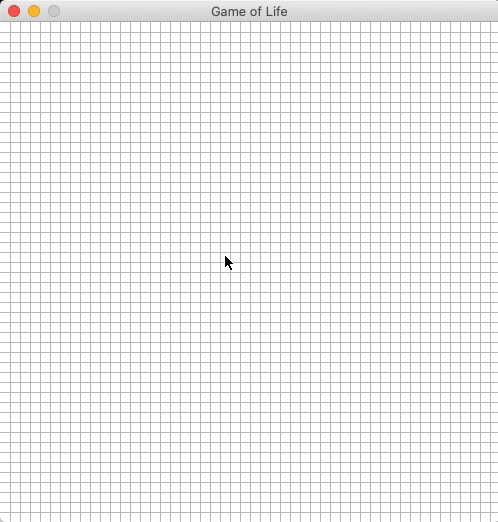

# Conway's Game of Life
> This project focuses on the visualization of an algorithm that solves for the Game of Life Problem. The project allows the user to simulate different scenarios and can create different patterns that would result to different results.

### Technologies
- Python3
- Pygame

---

## How to Use:

1. The project will start with an empty grid that simulates a game board.
2. You can click with the left-mouse button to create the blue rectangles which are the cells or population.
3. You can delete cells with a right-mouse button click.
4. To start the game, press the spacebar.
5. If you want to pause the game, press the spacebar again.

## Animation for the R-pentomino Pattern

---

## Author Info

- LinkedIn - [Charles Ezra Cabauatan](https://www.linkedin.com/in/charles-ezra-cabauatan-77baa6191/)
- Website - [charlesezra.github.io](https://charlesezra.github.io)
- Twitter - [@yupocharlie](https://twitter.com/yupocharlie)

[Back To The Top](#Task-Manager)

---